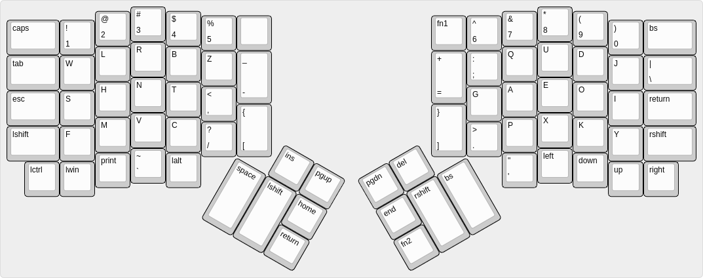
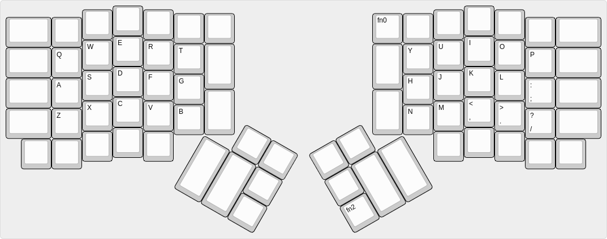
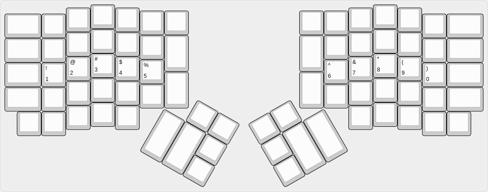

# Ergodone Layout

### Function keys

| Key   | Action                            |
| ----- | --------------------------------- |
| `fn0` | Layer action: Set default layer 0 |
| `fn1` | Layer action: Set default layer 1 |
| `fn2` | Layer action: Momentary layer 2   |

### Layer #0 - base

### Layer #1 - qwerty

### Layer #2 - number

### Resources

- Halmak Keyboard Layout https://github.com/MadRabbit/halmak
