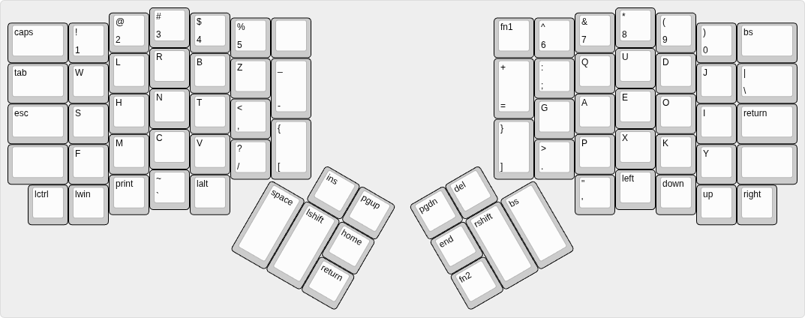
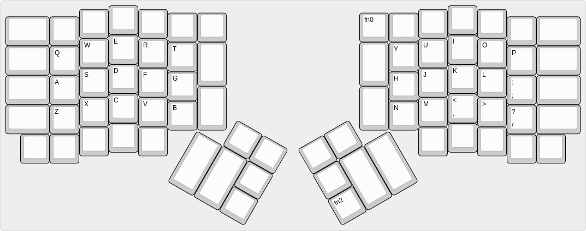
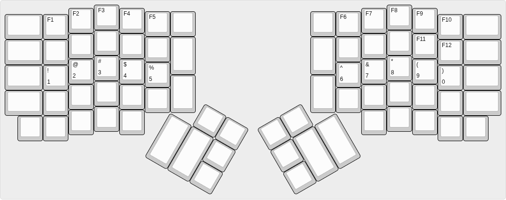

# Ergodone Layout

Keymap for an [ErgoDone](https://github.com/Rouji/Ergodone-Setup) running TMK
firmware. The layout is drawn in keyboard-layout-editor, compiled to an EEPROM
image on tkg.io, and written to the keyboard with `nix run .#flash`.

## Flashing

```bash
nix run .#flash                 # write keymap.eep (the usual case)
nix run .#flash -- --firmware   # rewrite the TMK firmware itself
nix run .#flash -- other.eep    # write some other image
```

`direnv allow` also puts `flash` and `hid_bootloader_cli` straight on `PATH`.

The flasher waits for the bootloader, so start it first and plug the keyboard in
afterwards. It runs under `sudo` because no udev rule grants this user the
bootloader device — see below to remove that.

### Bootloader modes — get this right

The keyboard has two bootloader modes, chosen by which keys you hold **while
plugging it in**. `hid_bootloader_cli` only streams bytes; the *keyboard* decides
where they land:

| Hold while plugging in                            | Mode     | Writes to     | Flash this |
| ------------------------------------------------- | -------- | ------------- | ---------- |
| **One** rightmost key, top row, left half          | keymap   | EEPROM        | `.eep`     |
| **Two** rightmost keys, top row, left half         | firmware | program flash | `.hex`     |

Writing a `.eep` while the board is in *firmware* mode puts 1 KB on top of the
reset and interrupt vectors at `0x0000` and kills the firmware. The symptom is a
keyboard that does nothing and drops into the bootloader with no keys held,
because there is no working application left to boot. `flash` prints the
combination it expects, so follow what it says rather than working from memory.

Recovering from that is just the firmware mode plus:

```bash
nix run .#flash -- --firmware   # restore the TMK firmware
nix run .#flash                 # then re-apply the keymap, in keymap mode
```

`ergodone.hex` spans `0x0000`–`0x6A80` and the bootloader lives at `0x7000`, so
the bootloader is never overwritten and the keyboard is always recoverable this
way.

## Editing the layout

`keymap.eep` was originally generated by tkg.io. **Every tkg.io mirror is now
offline**, so the image has to be edited by hand:

1. Edit the keycode byte in `keymap.eep`. The image is a 1 KB EEPROM dump in
   Intel HEX; keycodes are one byte per matrix position from `0x53`, layer 0
   first. `tools/eep.py` decodes it if you need to find an offset.
2. **Repair the checksum** — see below. This step is not optional.
3. Update the matching `layers/*.kle` and **re-export its `.png`**; they drift
   apart easily, which is how the number layer spent two years showing no
   F-keys. Paste the raw data into <http://www.keyboard-layout-editor.com/>.
4. Flash, then check the result with `showkey -a`.

### The checksum

The image carries a 16-bit checksum at `0x11`–`0x12`: a little-endian **word**
sum over `0x13`–`0x2F2`, seeded with TMK's `EECONFIG_MAGIC_NUMBER` (`0xFEED`).

Because it sums 16-bit words and not bytes, byte position matters — an even
offset carries weight 256 and its neighbour weight 1. Transposing two adjacent
keycodes changes the checksum even though the byte total is unchanged.

Getting this wrong is worse than making no edit at all. `check_keymap_in_eeprom()`
fails, and the firmware responds by *overwriting* EEPROM with its compiled-in
default keymap. The symptom is a keyboard that boots into stock qwerty after a
couple of seconds of delay — that pause is 736 bytes of EEPROM being rewritten
on every plug-in.

```bash
nix run .#eep -- keymap.eep          # verify
nix run .#eep -- keymap.eep --fix    # recompute and write back
```

`flash` verifies before writing, so a stale checksum is refused rather than
discovered on the keyboard.

Reference: `keymap_in_eeprom.c` in [kairyu/tmk_core_custom](https://github.com/kairyu/tmk_core_custom).

### Function keys

| Key   | Action                            |
| ----- | --------------------------------- |
| `fn0` | Layer action: Set default layer 0 |
| `fn1` | Layer action: Set default layer 1 |
| `fn2` | Layer action: Momentary layer 2   |

### Layer #0 - base



### Layer #1 - qwerty



### Layer #2 - number



## Flashing without sudo

`hardware.keyboard.qmk.enable` is not enough — `qmk-udev-rules` covers
`1209:2302`, but this keyboard's HID bootloader is `1209:2327`. Add to the NixOS
config instead, then drop the `sudo` from `flash` in `flake.nix`:

```nix
services.udev.extraRules = ''
  SUBSYSTEMS=="usb", ATTRS{idVendor}=="1209", ATTRS{idProduct}=="2327", TAG+="uaccess"
  SUBSYSTEMS=="usb", ATTRS{idVendor}=="16c0", ATTRS{idProduct}=="0478", TAG+="uaccess"
  SUBSYSTEMS=="usb", ATTRS{idVendor}=="03eb", ATTRS{idProduct}=="2ff4", TAG+="uaccess"
'';
```

Confirm the ID first: with the keyboard in its bootloader, `lsusb` should show
`1209:2327` (it is `1209:2328` when running normally).

## Layout of this repo

| Path            | What it is                                                  |
| --------------- | ----------------------------------------------------------- |
| `keymap.eep`    | The EEPROM image that gets flashed; built by tkg.io          |
| `layers/*.kle`  | keyboard-layout-editor raw data — the layout source          |
| `layers/*.png`  | Renders of the above, for this README                        |
| `vendor/`       | The flashing binary and stock firmware; see `vendor/README.md` |
| `flake.nix`     | Builds the flasher and the dev shell                         |

## Resources

- Halmak keyboard layout <https://github.com/MadRabbit/halmak>
- ErgoDone setup guide <https://github.com/Rouji/Ergodone-Setup>
- tkg-toolkit <https://github.com/Rouji/tkg-toolkit>
